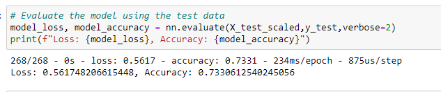
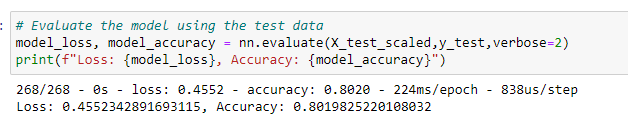

# Neural_Network_Charity_Analysis

## Overview of the analysis
Need to help this foundation predict where to make investments. I will use features in the dataset to create a binary classifier that is capable of predicting whether applicants will be successful if funded by Alphabet Soup. 

## Results

### Data Preprocessing
  - What variable(s) are considered the target(s) for your model? 'IS_SUCCESSFUL' - that predicts if applicants will be successful if funded by Alphabet Soup Business.
  - What variable(s) are considered to be the features for your model? 
    - 'NAME'
    - 'APPLICATION_TYPE': binned
    - 'AFFILIATION'
    - 'CLASSIFICATION': binned
    - 'USE_CASE'
    - 'ORGANIZATION' 
    - 'INCOME_AMT'
    - 'ASK_AMT' 
   
  - What variable(s) are neither targets nor features, and should be removed from the input data?
    - 'EIN'
    - 'STATUS'
    - 'SPECIAL_CONSIDERATIONS'
 
 ### Compiling, Training, and Evaluating the Model
  - How many neurons, layers, and activation functions did you select for your neural network model, and why? 
    - 3 hidden layers
    - 120, 60, 10 neurons for layer 1, layer 2, and layer 3.
    - ReLU was used for layer 1 and layer 2, and Sigmoid was used for the layer 3.
  
  - Were you able to achieve the target model performance? 
    - Yes! My optimized model has 79.5% with 0.46 of loss.
     
  - What steps did you take to try and increase model performance?
    - Just the model without optimization: Accuracy was 73.3% with 0.56 of loss. 
    
     
     
    - Last attempt: Accuracy was 80.2% with loss of 0.45.

     

## Summary: 
After 3-4 attempts on adjusting bins for APPLICATION_TYPE and CLASSIFICATION, getting & encoding NAME, and adding neurons, layers, and additional epochs, 
I found out that adding neurons, layers and additional epochs impacted the most on the accuracy change to higher percentage. 
